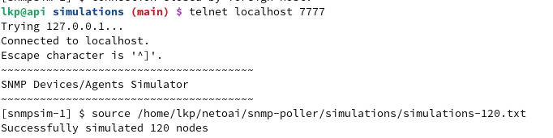

## SNMP Poller

### Prerequisites for Simulator and SNMP Poller

1. Install openJDK 8
2. Install python3 (3.10 or 3.11)
3. Install apache maven build tool.
4. Preferred OS for simulation would be CentOS/RHEL/Fedora

### Adding dummy IP addresses for simulator on Fedora 41
1. Load the dummy kernel module
```shell
sudo modprobe dummy
```
2. Create a dummy interface
```shell
sudo ip link add name dummy0 type dummy
```
3. Add an IP Address
```shell
sudo ip addr add 192.168.100.1/24 dev dummy0
```
4. Bring up the dummy interface with dummy IP
```shell
sudo ip link set dummy0 up
```
5. Create the dummy IP Addresses using the below command
```shell
sudo /bin/bash simulations/add-dummy-ips.sh
``` 
6. Verify if the interface is up and running
```shell
ip addr show dummy0
```

### Running the Simulation

1. Before starting the simulation run the below command to increase the read/write network buffers. (This is applicable for RHEL/CentOS/Fedora OS)
```shell
sudo /bin/bash scripts/setKernelParams.sh
```

2. Start the simulator process using the below command.
```shell
cd snmp-poller/simulations
sudo java -cp snmp-sim-out.jar com.ab.sim.snmp.SimMain
```

3. Create simulations for 120 device using the below commands
```shell
telnet localhost 7777
source <Path to Repo>/snmp-poller/simulations/simulations-120.txt
```
** Below image shows the execution of above commands **


### Building and Running the poller

1. Building the docker image of SNMP Poller
```shell
./build-image.sh latest --no-push
```

2. Running the poller in a docker swarm. Please initialize the docker swarm if it is not done yet before running the below command.
```shell
docker stack deploy --with-registry-auth -c docker-compose.yml poller
```

3. Logs for the SNMP poller will be present in the snmp-poller container at the location '/opt/snmp-poller/logs/snmp-poller.log'

### Starting the inventory discovery

1. To start the inventory discovery send the JSON message shown below to the **collector_incoming_topic** kafka topic.
```json
{
  "msgType": "START_DISCOVERY",
  "payload": [
    {
      "uuid": "401884f6-a38a-44a0-b549-59dfe57f03e9",
      "name": "Sample Discovery Task",
      "ipRange": [
        "192.168.100.1-192.168.100.120"
      ],
      "schedule": "",
      "authProfiles": [
        {
          "uuid": "763b1ac5-8e79-46eb-9202-f5b180a1df7f",
          "name": null,
          "snmpVersion": "SNMPv2C",
          "port": 161,
          "userName": null,
          "secLevel": "AUTHNOPRIV",
          "contextName": null,
          "community": "public",
          "authProtocol": "NONE",
          "authPassword": null,
          "privProtocol": "NONE",
          "privPassword": null,
          "defaultForNew": false,
          "timeout": 15,
          "retries": 3,
          "userRole": null,
          "createdByUser": null
        }
      ],
      "credentials": [],
      "enableIcmp": false,
      "active": true,
      "status": "CREATED",
      "lastRun": 0,
      "discoveryType": "INVENTORY",
      "enableSchedule": false
    }
  ],
  "beanType": null
}
```
- The ipRange should contain the list of IP addresses or range of IP addresses valid formats are given below
  - 192.168.100.1 (Single IP)
  - 192.168.100.1,192.168.100.2 (List of IPs)
  - 192.168.100.1-192.168.100-120 (Range of IPs)
- The "authProfiles" field contains the SNMP credentials to connect to the above IP addresses. Note that the same credentials provided in this field will be used to connect to all the IP addresses.
  - Valid values for "snmpVersion" include 'SNMPv2C' as shown above and 'SNMPv3' 
- In case of inventory discovery the value for "discoveryType" should be 'INVENTORY' as shown above.

2. To start the topology discovery send the JSON message shown below to the **collector_incoming_topic** kafka topic.
```json
{
  "msgType": "START_DISCOVERY",
  "payload": [
    {
      "uuid": "61f113c3-a283-4e72-bf5b-2d569d338612",
      "name": "Sample Topology Discovery Task",
      "ipRange": [
        "192.168.100.1-192.168.100.120"
      ],
      "schedule": "",
      "authProfiles": [
        {
          "uuid": "ee57cc9e-8475-40e9-99e3-277b1fe6429d",
          "name": null,
          "snmpVersion": "SNMPv2C",
          "port": 161,
          "userName": null,
          "secLevel": "AUTHNOPRIV",
          "contextName": null,
          "community": "public",
          "authProtocol": "NONE",
          "authPassword": null,
          "privProtocol": "NONE",
          "privPassword": null,
          "defaultForNew": false,
          "timeout": 15,
          "retries": 3,
          "userRole": null,
          "createdByUser": null
        }
      ],
      "credentials": [],
      "enableIcmp": true,
      "active": true,
      "status": "CREATED",
      "lastRun": 0,
      "discoveryType": "TOPOLOGY",
      "enableSchedule": false
    }
  ],
  "beanType": null
}
```
- The "discoveryType" attribute should contain the value 'TOPOLOGY' for this JSON. The remaining attributes are same as the inventory JSON.

3. The topology message should be sent after the inventory message is sent and the poller discovers the network elements.
4. The SNMP poller sends the inventory and topology output JSONs to the **inventory_topic** kafka topic.
